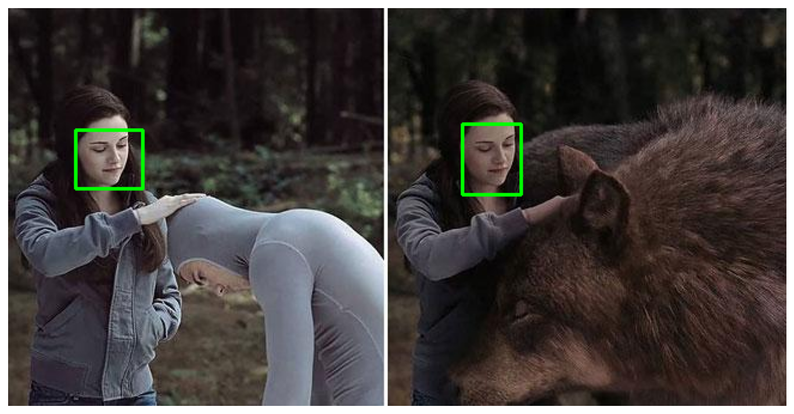

## Detectron 2 to detect objective

__Face Detection on Custom Dataset with Detectron2 and PyTorch__

### What is Detectron 2 ?

* Detectron 2 is a framework for building state of the art object detection and image segmentation models. It is developed by the Facebook Research team.

* The real power of Detectron2 lies in the HUGE amount of pre-trained models available at the Model Zoo.

* It is powered by the [PyTorch] deep learning framework.

* Includes more features such as panoptic segmentation, Densepose, Cascade R-CNN, rotated bounding boxes, PointRend, DeepLab, ectc,....

* Here we benchmark the training speed of a Mask R-CNN in detectron2, with some other popular open source Mask R-CNN implementations, this based on: https://detectron2.readthedocs.io/notes/benchmarks.html

* Models can be exported to torchscript format or caffe2 format for deployment.

### Installation
I have used Detectron2 an alpha stage
Installing through colab ( as notebook above) which details as `bash script`:
Install dependencies: (use cu101 because colab has CUDA 10.1)

`!pip install -U torch==1.5 torchvision==0.6 -f https://download.pytorch.org/whl/cu101/torch_stable.html 
!pip install cython pyyaml==5.1
!pip install -U 'git+https://github.com/cocodataset/cocoapi.git#subdirectory=PythonAPI'
import torch, torchvision
print(torch.__version__, torch.cuda.is_available())
!gcc --version`

__Install detectron2__

`!pip install detectron2==0.1.3 -f https://dl.fbaipublicfiles.com/detectron2/wheels/cu101/tor`

### Data Preprocessing
The dataset contains only image URLs and annotations. This'll have to downloaf the images. This'll also normalize the annotations, so it's easier to use them with Detectron2 later on:
`!gdown --id 1K79wJgmPTWamqb04Op2GxW0SW9oxw8KS`
After that, we'll read json file as here:
`facces_df = pd.read_json('face_detection.json', line = True)`

### Conclusion
That's the power of large pre-trained models.

